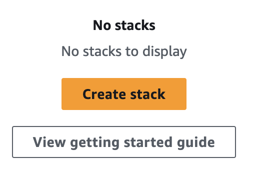
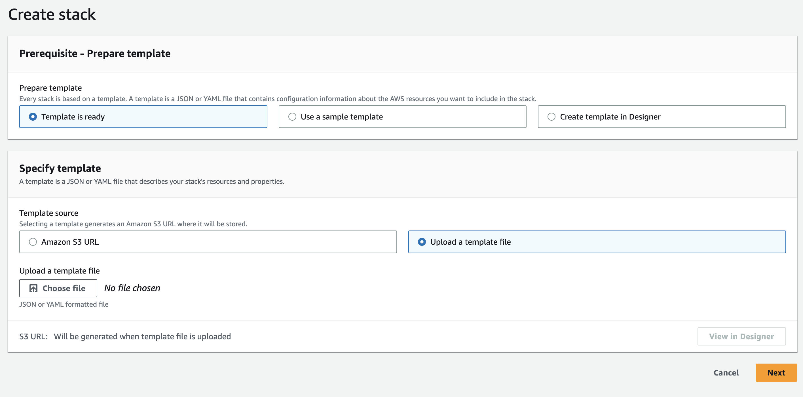
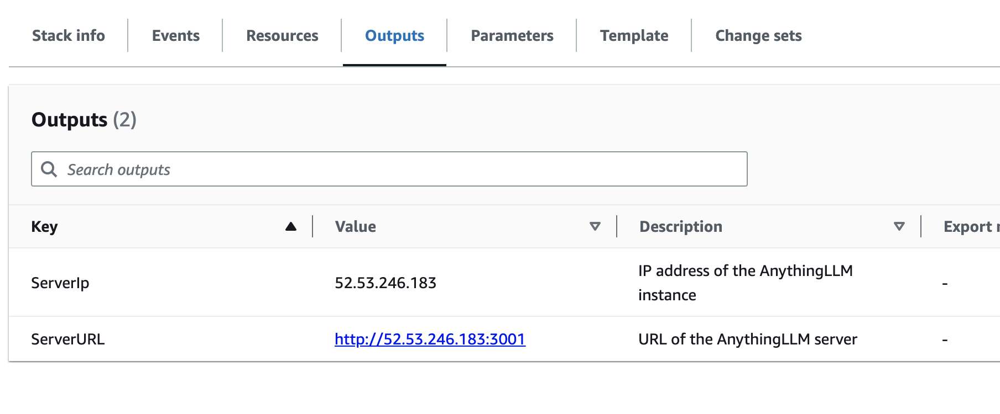

# How to deploy a private AnythingLLM instance on AWS

With an AWS account you can easily deploy a private AnythingLLM instance on AWS. This will create a url that you can access from any browser over HTTP (HTTPS not supported). This single instance will run on your own keys and they will not be exposed - however if you want your instance to be protected it is highly recommend that you set the `AUTH_TOKEN` and `JWT_SECRET` variables in the `docker/` ENV.

**Quick Launch (EASY)**
2. Log in to your AWS account
3. Open [CloudFormation](https://us-west-1.console.aws.amazon.com/cloudformation/home)
4. Ensure you are deploying in a geographic zone that is nearest to your physical location to reduce latency.
5. Click `Create Stack`
6. Use the file `create_anythinng_llm_instance.json` as your JSON template.
7. Launch. On first boot fill out your ENV keys and you are fully live. Time to boot is approximately 60 seconds.
Done.

**Custom Launch and Build From Source**
[Refer to .env.example](../../../docker/HOW_TO_USE_DOCKER.md) for data format.

The output of this cloudformation stack will be:
- 1 EC2 Instance
- 1 Security Group with 0.0.0.0/0 access on Ports 22 & 3001
- 1 EC2 Instance Volume `gb2` of 10Gib minimum

**Requirements**
- An AWS account with billing information.
  - AnythingLLM (GUI + document processor) must use a t2.small minimum and 10Gib SSD hard disk volume
- `.env` file that is filled out with your settings and set up in the `docker/` folder

## How to deploy on AWS

1. Generate your specific cloudformation document by running `yarn generate:cloudformation` from the project root directory.
2. Log in to your AWS account
3. Open [CloudFormation](https://us-west-1.console.aws.amazon.com/cloudformation/home)
4. Ensure you are deploying in a geographic zone that is nearest to your physical location to reduce latency.
5. Click `Create Stack`



6. Upload your `aws_cf_deploy_anything_llm.json` to the stack



7. Click `Next` and give your stack a name. This is superficial.
8. No other changes are needed, just proceed though each step
9. Click `Submit`
10. Wait for stack events to finish and be marked as `Completed`
11. View `Outputs` tab.



## Please read this notice before submitting issues about your deployment

**Note:** 
Your instance will not be available instantly. Depending on the instance size you launched with it can take anywhere from 10-20 minutes to fully boot up.

If you want to check the instance's progress, navigate to [your deployed EC2 instances](https://us-west-1.console.aws.amazon.com/ec2/home) and connect to your instance via SSH in browser.

Once connected run `sudo tail -f /var/log/cloud-init-output.log` and wait for the file to conclude deployment of the docker image.
You should see an output like this
```
[+] Running 2/2
 ⠿ Network docker_anything-llm  Created 
 ⠿ Container anything-llm       Started  
```

Additionally, your use of this deployment process means you are responsible for any costs of these AWS resources fully.