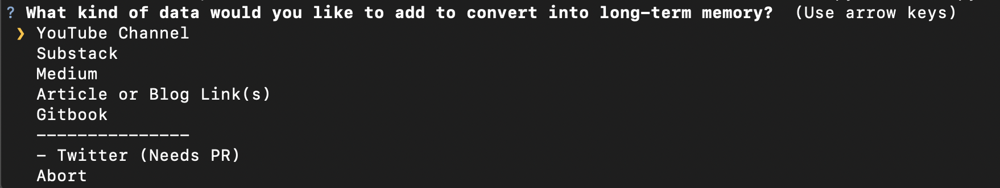
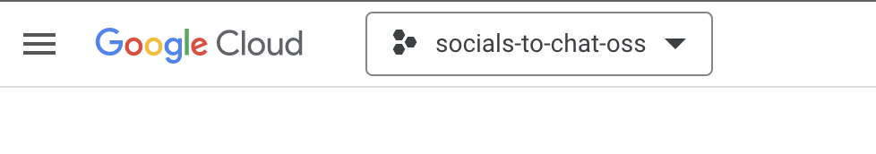

# How to collect data for vectorizing
This process should be run first. This will enable you to collect a ton of data across various sources. Currently the following services are supported:
- [x] YouTube Channels
- [x] Medium
- [x] Substack
- [x] Arbitrary Link
- [x] Gitbook
- [x] Local Files (.txt, .pdf, etc) [See full list](./hotdir/__HOTDIR__.md)
_these resources are under development or require PR_
- Twitter

### Requirements
- [ ] Python 3.8+
- [ ] Google Cloud Account (for YouTube channels)
- [ ] `brew install pandoc` [pandoc](https://pandoc.org/installing.html) (for .ODT document processing) 

### Setup
This example will be using python3.9, but will work with 3.8+. Tested on MacOs. Untested on Windows
- install virtualenv for python3.8+ first before any other steps. `python3.9 -m pip install virtualenv`
- `cd collector` from root directory
- `python3.9 -m virtualenv v-env`
- `source v-env/bin/activate`
- `pip install -r requirements.txt`
- `cp .env.example .env`
- `python main.py` for interactive collection or `python watch.py` to process local documents.
- Select the option you want and follow follow the prompts - Done!
- run `deactivate` to get back to regular shell

### Outputs
All JSON file data is cached in the `output/` folder. This is to prevent redundant API calls to services which may have rate limits to quota caps. Clearing out the `output/` folder will execute the script as if there was no cache.

As files are processed you will see data being written to both the `collector/outputs` folder as well as the `server/documents` folder. Later in this process, once you boot up the server you will then bulk vectorize this content from a simple UI!

If collection fails at any point in the process it will pick up where it last bailed out so you are not reusing credits.

### How to get a Google Cloud API Key (YouTube data collection only)
**required to fetch YouTube transcripts and data**
- Have a google account
- [Visit the GCP Cloud Console](https://console.cloud.google.com/welcome)
- Click on dropdown in top right > Create new project. Name it whatever you like
  - 
- [Enable YouTube Data APIV3](https://console.cloud.google.com/apis/library/youtube.googleapis.com)
- Once enabled generate a Credential key for this API
- Paste your key after `GOOGLE_APIS_KEY=` in your `collector/.env` file.
