# AnythingLLM Multi-Tenant SaaS Analysis & Design Document

## Executive Summary

This document provides a comprehensive analysis of AnythingLLM's suitability for deployment as a multi-tenant SaaS solution for providing ChatGPT-like chat web applications to enterprise clients. The analysis covers architectural assessment, gap identification, and implementation recommendations.

The time and cost estimates in the document are AI generated, they are NOT verified.

### Key Findings

**Current State**: AnythingLLM is a well-architected, monolithic application with excellent extensibility through provider patterns and clear service separation. It supports basic multi-user functionality and has robust integration capabilities with 25+ LLM providers and 10+ vector databases.

**Recommended Approach**: Deploy multiple Docker instances across separate GCP projects for infrastructure-level tenant isolation, rather than implementing application-level multi-tenancy. This approach provides perfect data isolation while maintaining operational simplicity.

**Development Effort**: Estimated 3-4 months with 2-3 developers plus 1 DevOps engineer (~8-10 person-months total).

**Viability**: Highly recommended with this approach - eliminates complex application-level multi-tenancy while providing superior isolation and security.

---

## Usage Use Case

### Target Requirements

The system shall provide a full-featured ChatGPT-like chat web application with the following specifications:

1. **Multi-Client Architecture**: Support multiple independent clients (organizations/companies)
2. **Team Management**: Each client can have multiple teams with separate access control
3. **Multi-Tenant Management**: Complete data isolation between clients with separate admin and user management
4. **UI Extensibility**: Ability to customize appearance, branding, themes per client
5. **Enterprise Features**: Admin dashboards, usage analytics, potential billing integration

### Deployment Strategy

- **Infrastructure Isolation**: Deploy separate Docker instances to different GCP projects
- **One Instance Per Client/Team**: Each client or client team gets dedicated infrastructure
- **Centralized Management**: Unified control plane for managing multiple client deployments
- **Configuration-Driven Customization**: Single codebase with runtime configuration rather than per-client code forks

### Platform & Technology Constraints

- **Platform**: Google Cloud Platform (GCP) as primary deployment platform
- **Containerization**: Docker-based deployment model
- **Code Management**: Single forked repository with configuration-based customization
- **Scalability**: Infrastructure-level scaling per client rather than application-level

---

## Gap Analysis

### Current Capabilities Assessment

#### Strengths ✅
- **Solid Architecture**: Clean three-tier architecture (Frontend, Server, Collector) with clear separation of concerns
- **Extensive Provider Support**: 25+ LLM providers, 10+ vector databases with excellent abstraction patterns
- **Basic Multi-User Support**: Role-based access control with admin, manager, and default user roles
- **Workspace Isolation**: Existing workspace concept provides team-like functionality
- **UI Customization Foundation**: Basic branding options (logos, themes, app names)
- **Docker Deployment**: Containerized deployment with health checks
- **Configuration Management**: Environment-based configuration system

#### Current Architecture

```mermaid
graph TB
    subgraph "AnythingLLM Current Architecture"
        Frontend["Frontend (React SPA)<br/>Port: 3000<br/>• UI Components<br/>• WebSocket Client<br/>• State Management"]
        
        Server["Server (Express.js)<br/>Port: 3001<br/>• API Gateway<br/>• Authentication<br/>• Business Logic<br/>• Agent Management<br/>• WebSocket Handler"]
        
        Collector["Collector Service<br/>Port: 8888<br/>• Document Parser<br/>• Text Processing<br/>• File Conversion"]
        
        Database[("Database<br/>SQLite/PostgreSQL<br/>• Users & Workspaces<br/>• Chat History<br/>• Metadata")]
        
        Storage[("File Storage<br/>Local Filesystem<br/>• Documents<br/>• Models<br/>• Assets")]
        
        VectorDB[("Vector Database<br/>LanceDB/Pinecone/Chroma<br/>• Embeddings<br/>• Similarity Search")]
    end
    
    subgraph "External Services"
        LLM["LLM Providers<br/>• OpenAI<br/>• Anthropic<br/>• Ollama<br/>• 25+ others"]
        
        EmbedProviders["Embedding Services<br/>• OpenAI Embeddings<br/>• Cohere<br/>• Local Models"]
    end
    
    Frontend ---|HTTP/WebSocket| Server
    Server ---|REST API| Collector
    Server ---|Query/Store| Database
    Server ---|File I/O| Storage
    Server ---|Vector Ops| VectorDB
    Server ---|API Calls| LLM
    Collector ---|Generate| EmbedProviders
    Collector ---|Store| VectorDB
    Collector ---|Save| Storage
```



### Critical Gaps Identified

#### 1. Multi-Instance Deployment - MODERATE GAP
**Current**: Single-instance deployment with basic GCP template  
**Required**: Multi-project orchestration with centralized management

**Missing Components**:
- No infrastructure-as-code for multi-project deployment
- No centralized instance registry or management portal
- No automated deployment across multiple GCP projects
- No cross-project monitoring and observability

#### 2. Configuration Management - SIGNIFICANT GAP
**Current**: Basic environment variables and limited UI customization  
**Required**: Hierarchical configuration system with runtime customization

**Missing Components**:
- No hierarchical configuration (Global → Client → Instance)
- Limited UI theming and branding capabilities
- No feature toggle system
- No client-specific settings management
- No configuration validation and versioning

#### 3. GCP Integration - MAJOR GAP
**Current**: Basic VM deployment with minimal GCP service integration  
**Required**: Cloud-native deployment with managed services

**Missing Components**:
- No managed storage integration (Cloud Storage, Filestore)
- No Secret Manager integration for sensitive data
- No cloud-native container orchestration (Cloud Run/GKE)
- No GCP monitoring and logging integration
- No automated backup and disaster recovery

#### 4. Centralized Management - MAJOR GAP
**Current**: Individual instance management only  
**Required**: Unified management platform for all client instances

**Missing Components**:
- No management control plane
- No cross-project deployment orchestration
- No aggregated monitoring and alerting
- No billing and usage tracking per client
- No automated update and maintenance system

#### 5. Security & Compliance - MODERATE GAP
**Current**: Basic JWT authentication with workspace isolation  
**Required**: Enterprise-grade security with audit trails

**Missing Components**:
- No SSO/SAML integration per client
- Limited audit logging and compliance reporting
- No advanced security features (rate limiting, DDoS protection)
- No data encryption at rest per client
- No compliance frameworks (SOC2, GDPR)

### Architectural Debt

#### Technical Debt
- **No Automated Testing**: Minimal test coverage across all services
- **Inconsistent Error Handling**: No standardized error response patterns
- **Performance Gaps**: No caching strategy, synchronous processing
- **Configuration Scattered**: Environment variables across services without validation

#### Operational Debt
- **Limited Monitoring**: Basic logging without structured observability
- **Manual Deployment**: No CI/CD pipeline for automated deployments
- **No Backup Strategy**: No automated backup and recovery procedures
- **Documentation Gaps**: Limited operational and architectural documentation

---

## AnythingLLM Architectural Design

### Technology Stack Analysis

#### Core Foundation
- **Runtime**: Node.js v18+ across all services
- **Package Management**: Yarn for monorepo dependency management
- **Database**: Prisma ORM with SQLite (default) / PostgreSQL (production)
- **Architecture**: Three-service monorepo (Frontend, Server, Collector)

#### Frontend Technology Ecosystem
```javascript
// React Foundation
React 18.2.0               // Modern hooks and Context API
Vite 4.3.0                // Fast development and building
Tailwind CSS 3.3.1       // Utility-first styling
React Router DOM 6.3.0   // Client-side routing

// UI Libraries
@tremor/react 3.15.1      // Data visualization
@phosphor-icons/react 2.1.7 // Icon library
react-beautiful-dnd 13.1.1  // Drag-and-drop
react-toastify 9.1.3      // Notifications

// Text Processing
markdown-it 13.0.1        // Markdown rendering
highlight.js 11.9.0       // Syntax highlighting
dompurify 3.0.8          // XSS protection
katex 0.6.0              // Math rendering

// AI/ML Features
@mintplex-labs/piper-tts-web 1.0.4 // Text-to-speech
onnxruntime-web 1.18.0    // ML inference in browser
```

#### Backend Technology Ecosystem
```javascript
// Core Framework
Express.js 4.18.2         // HTTP server framework
@mintplex-labs/express-ws 5.0.7 // WebSocket support
@mintplex-labs/bree 9.2.5 // Background job scheduler

// Database & ORM
Prisma 5.3.1             // Database ORM
pg 8.11.5                // PostgreSQL driver
mysql2 3.9.8             // MySQL driver

// AI/LLM Integrations (25+ providers)
openai 4.95.1            // OpenAI SDK
@anthropic-ai/sdk 0.39.0 // Anthropic Claude
@aws-sdk/client-bedrock-runtime 3.775.0 // AWS Bedrock
cohere-ai 7.9.5          // Cohere
ollama 0.5.10            // Ollama local models

// Vector Databases (10+ providers)
chromadb 2.0.1           // Chroma vector DB
@pinecone-database/pinecone 2.0.1 // Pinecone
@qdrant/js-client-rest 1.9.0 // Qdrant
@lancedb/lancedb 0.15.0  // LanceDB (default)

// ML/Embeddings
@xenova/transformers 2.14.0 // Local embeddings
langchain 0.1.36         // LangChain framework

// Security
bcrypt 5.1.0             // Password hashing
jsonwebtoken 9.0.0       // JWT tokens
joi 17.11.0              // Input validation
```

#### Document Processing Stack
```javascript
// Document Parsers
pdf-parse 1.1.1          // PDF text extraction
mammoth 1.6.0            // Word document parsing
node-xlsx 0.24.0         // Excel parsing
epub2 3.0.2              // EPUB parsing

// Web Scraping & Processing
puppeteer 21.5.2         // Web scraping
cheerio 1.0.0            // HTML parsing
tesseract.js 6.0.0       // OCR processing

// Media Processing
fluent-ffmpeg 2.1.2      // Audio/video processing
wavefile 11.0.0          // Audio file handling
sharp 0.33.5             // Image processing
```

### Architecture Patterns

#### Design Patterns Used
1. **Provider Pattern**: Extensive use for LLM and vector database abstraction
2. **Repository Pattern**: Prisma-based data access layer
3. **Middleware Pattern**: Express middleware for cross-cutting concerns
4. **Observer Pattern**: WebSocket implementation for real-time features
5. **Strategy Pattern**: Runtime provider selection based on configuration

#### Service Communication
```
Frontend (React) ←→ Server (Express) ←→ Collector (Express)
      ↓                    ↓                    ↓
WebSocket Client    Background Jobs      Document Parser
      ↓                    ↓                    ↓
Real-time UI        Vector Operations    Text Processing
```

#### Data Flow Architecture

```mermaid
flowchart TD
    subgraph "User Interaction"
        User[("👤 User")]
        UI["Web Interface<br/>(React SPA)"]
        Chat["Chat Interface<br/>• Message Input<br/>• File Upload<br/>• Real-time Response"]
    end
    
    subgraph "Document Processing Pipeline"
        Upload["📁 File Upload<br/>• PDF, DOCX, TXT<br/>• Images, Audio<br/>• Web URLs"]
        
        Collector["🔄 Collector Service<br/>• File Parsing<br/>• Text Extraction<br/>• Format Conversion"]
        
        TextProcess["📝 Text Processing<br/>• Cleaning<br/>• Language Detection<br/>• Content Validation"]
        
        Chunking["✂️ Text Chunking<br/>• LangChain Splitter<br/>• Semantic Boundaries<br/>• Overlap Management"]
        
        Embedding["🧠 Embedding Generation<br/>• OpenAI/Local Models<br/>• Vector Conversion<br/>• Dimension Reduction"]
    end
    
    subgraph "Storage Layer"
        FileStore[("💾 File Storage<br/>Local/Cloud Storage<br/>• Original Documents<br/>• Processed Files<br/>• Asset Cache")]
        
        MetaDB[("🗃️ Metadata DB<br/>PostgreSQL/SQLite<br/>• Document Info<br/>• User Data<br/>• Chat History")]
        
        VectorStore[("🔍 Vector Database<br/>Pinecone/Chroma/LanceDB<br/>• Embeddings<br/>• Similarity Search<br/>• Semantic Index")]
    end
    
    subgraph "Chat Processing"
        Query["❓ User Query<br/>• Natural Language<br/>• Context Aware<br/>• Intent Recognition"]
        
        Retrieval["🔎 Vector Retrieval<br/>• Similarity Search<br/>• Context Ranking<br/>• Relevance Scoring"]
        
        LLMCall["🤖 LLM Processing<br/>• Context Injection<br/>• Response Generation<br/>• Stream Processing"]
        
        Response["💬 Response Delivery<br/>• Real-time Streaming<br/>• Citation Links<br/>• Follow-up Suggestions"]
    end
    
    %% User Flow
    User ---|Interact| UI
    UI ---|Chat/Upload| Chat
    Chat ---|Files| Upload
    Chat ---|Questions| Query
    
    %% Document Processing Flow
    Upload ---|Process| Collector
    Collector ---|Extract Text| TextProcess
    TextProcess ---|Split| Chunking
    Chunking ---|Generate| Embedding
    
    %% Storage Operations
    Collector ---|Save Files| FileStore
    TextProcess ---|Store Metadata| MetaDB
    Embedding ---|Store Vectors| VectorStore
    
    %% Chat Flow
    Query ---|Search| Retrieval
    Retrieval ---|Query Vectors| VectorStore
    Retrieval ---|Get Context| MetaDB
    Retrieval ---|Send to| LLMCall
    LLMCall ---|Generate| Response
    Response ---|Display| Chat
    
    %% Feedback Loop
    Response ---|Store History| MetaDB
    User ---|Feedback| Query
    
    style Upload fill:#e1f5fe
    style Collector fill:#f3e5f5
    style VectorStore fill:#e8f5e8
    style LLMCall fill:#fff3e0
    style Response fill:#f1f8e9
```



### Database Schema Analysis

#### Core Entities
```prisma
model users {
  id                Int      @id @default(autoincrement())
  email             String?  @unique
  password          String
  role              String   @default("default")
  createdAt         DateTime @default(now())
  lastUpdatedAt     DateTime @default(now())
}

model workspaces {
  id                Int      @id @default(autoincrement())
  name              String
  slug              String   @unique
  vectorTag         String?
  createdAt         DateTime @default(now())
  lastUpdatedAt     DateTime @default(now())
}

model workspace_users {
  id              Int        @id @default(autoincrement())
  user_id         Int
  workspace_id    Int
  createdAt       DateTime   @default(now())
  
  user            users      @relation(fields: [user_id], references: [id])
  workspace       workspaces @relation(fields: [workspace_id], references: [id])
  
  @@unique([user_id, workspace_id])
}
```

#### Strengths
- Clean relational model with proper foreign keys
- Good separation between users, workspaces, and content
- Extensible design with JSON fields for metadata
- Proper indexing through Prisma

#### Limitations for Multi-Tenancy
- No organization/client entity
- No tenant-level data partitioning
- No billing or usage tracking entities
- No audit trail or event logging

---

## Dependencies

### Runtime Dependencies

#### Critical Dependencies
```json
{
  "node": ">=18.12.1",
  "prisma": "5.3.1",
  "express": "4.18.2",
  "react": "18.2.0",
  "vite": "4.3.0"
}
```

#### AI/ML Dependencies
```json
{
  "openai": "4.95.1",
  "@anthropic-ai/sdk": "0.39.0",
  "@xenova/transformers": "2.14.0",
  "langchain": "0.1.36",
  "chromadb": "2.0.1",
  "@pinecone-database/pinecone": "2.0.1"
}
```

#### Infrastructure Dependencies
- **Container Runtime**: Docker with multi-platform support (ARM64/AMD64)
- **Database**: SQLite (development) / PostgreSQL (production)
- **File System**: Local storage with configurable paths
- **Network**: HTTP/HTTPS with WebSocket support

#### External Service Dependencies
- **LLM Providers**: OpenAI, Anthropic, AWS Bedrock, Google Gemini, local models
- **Vector Databases**: Pinecone, Chroma, Qdrant, Weaviate, LanceDB, Milvus
- **Embedding Services**: OpenAI, Cohere, Voyage AI, local embeddings

### Development Dependencies

#### Build & Development Tools
```json
{
  "eslint": "8.50.0",
  "prettier": "3.0.3",
  "nodemon": "2.0.22",
  "cross-env": "7.0.3",
  "concurrently": "9.1.2"
}
```

#### Testing Dependencies
```json
{
  "jest": "29.7.0"
}
```

**Note**: Testing infrastructure is minimal and requires significant expansion for production use.

### Deployment Dependencies

#### Container Requirements
- **Base Image**: Ubuntu 22.04 (Jammy)
- **Node.js**: v18.x with Yarn package manager
- **System Packages**: Chromium, FFmpeg, Python (for some ML operations)
- **Capabilities**: SYS_ADMIN for Chromium execution

#### GCP Service Dependencies
```yaml
required_gcp_services:
  - compute.googleapis.com          # Compute Engine or Cloud Run
  - storage-api.googleapis.com      # Cloud Storage
  - sql-component.googleapis.com    # Cloud SQL
  - secretmanager.googleapis.com    # Secret Manager
  - monitoring.googleapis.com       # Cloud Monitoring
  - logging.googleapis.com          # Cloud Logging
  - cloudbuild.googleapis.com       # Cloud Build (CI/CD)
  - artifactregistry.googleapis.com # Container Registry
```

### Dependency Risk Analysis

#### High Risk
- **Node.js v18+ Requirement**: Limits deployment flexibility
- **Chromium Dependency**: Requires privileged container capabilities
- **Heavy ML Dependencies**: Large container size, memory usage

#### Medium Risk
- **Multiple AI Provider SDKs**: Potential version conflicts
- **Database Driver Dependencies**: PostgreSQL/MySQL version compatibility
- **File Processing Libraries**: Platform-specific native dependencies

#### Mitigation Strategies
- Multi-stage Docker builds to minimize production image size
- Dependency version pinning for reproducible builds
- Alternative deployment strategies for restricted environments
- Comprehensive dependency security scanning

---

## Design Evaluation

### Architecture Assessment

#### Strengths ✅

1. **Excellent Provider Abstraction**
   - Clean interfaces for swapping AI services (25+ LLM providers, 10+ vector databases)
   - Runtime provider selection without code changes
   - Consistent error handling across providers

2. **Modular Service Design**
   - Clear separation between frontend, server, and document processing
   - Independent scaling potential for each service
   - Well-defined API boundaries

3. **Extensible Agent System**
   - Plugin architecture for custom agents
   - MCP (Model Context Protocol) integration
   - WebSocket-based real-time communication

4. **Modern Frontend Architecture**
   - React 18 with modern hooks and Context API
   - Vite for fast development and optimized builds
   - Comprehensive internationalization support (20+ languages)

5. **Robust Document Processing**
   - Support for 15+ document formats
   - OCR capabilities for images
   - Intelligent text chunking and embedding

#### Weaknesses ❌

1. **Limited Testing Coverage**
   - Minimal automated testing across all services
   - No integration testing for multi-service workflows
   - No performance testing or benchmarking

2. **Configuration Management**
   - Scattered configuration across environment variables
   - No configuration validation or schema
   - Limited runtime configuration updates

3. **Operational Readiness**
   - Basic logging without structured observability
   - No metrics collection or performance monitoring
   - Manual deployment and update processes

4. **Security Gaps**
   - No rate limiting or DDoS protection
   - Limited input validation in some endpoints
   - No comprehensive audit logging

5. **Scalability Constraints**
   - SQLite default limits horizontal scaling
   - Synchronous document processing
   - No background job queue for heavy operations

### Multi-Tenant Architecture Strategy

This section provides a comprehensive analysis of infrastructure-based vs application-based multi-tenancy approaches, including our recommended evolution path from infrastructure-level to application-level multi-tenancy as the business scales.

#### Multi-Tenancy Approach Comparison

```mermaid
graph LR
    subgraph "Infrastructure-Based Multi-Tenancy"
        InfraApproach["🏗️ Infrastructure Level<br/>• GCP Project per Client<br/>• Complete Resource Isolation<br/>• Higher Cost per Tenant<br/>• Maximum Security"]
    end
    
    subgraph "Application-Based Multi-Tenancy"
        AppApproach["💻 Application Level<br/>• Shared Infrastructure<br/>• Database-level Isolation<br/>• Lower Cost per Tenant<br/>• Complex Implementation"]
    end
    
    subgraph "Migration Path"
        Phase1["Phase 1: Infrastructure<br/>0-50 Clients<br/>Quick to Market"]
        Phase2["Phase 2: Hybrid<br/>50-200 Clients<br/>Cost Optimization"]
        Phase3["Phase 3: Application<br/>200+ Clients<br/>Scale Economics"]
    end
    
    InfraApproach ---|Start Here| Phase1
    Phase1 ---|Evaluate| Phase2
    Phase2 ---|Migrate to| AppApproach
    AppApproach ---|Scale to| Phase3
```



#### Infrastructure-Level Multi-Tenancy (Phase 1: 0-50 Clients) ✅

**Current Recommendation for Initial Deployment**

**Advantages**:
- **Perfect Data Isolation**: Complete separation via GCP projects
- **Simplified Security**: No complex tenant filtering needed
- **Independent Scaling**: Each client scales independently
- **Compliance Ready**: Easy to meet data residency requirements
- **Fault Isolation**: One client's issues don't affect others
- **Rapid Deployment**: Leverages existing AnythingLLM architecture
- **Zero Code Changes**: No application-level modifications required

**Cost Analysis (Infrastructure-Based)**:
```
Per-Client Monthly Cost (estimated):
├── Cloud Run (2 CPU, 4GB RAM): $45-90/month
├── Cloud SQL (db-standard-1): $50-100/month  
├── Cloud Storage (100GB): $5-10/month
├── Vector DB (Pinecone/Chroma): $20-70/month
├── Load Balancer & Networking: $10-20/month
└── Monitoring & Logging: $5-15/month
Total: ~$135-305 per client/month
```

**Implementation Approach**:
```yaml
deployment_strategy:
  isolation_level: "infrastructure"
  deployment_unit: "gcp_project_per_client"
  management: "centralized_control_plane"
  customization: "configuration_driven"
  scaling_threshold: "50_clients_maximum"
```

**When to Use Infrastructure-Based**:
- **Startup Phase**: 0-50 clients, proving market fit
- **Enterprise Clients**: High-value clients requiring maximum isolation
- **Compliance Requirements**: HIPAA, SOC2, data residency needs
- **Rapid Time-to-Market**: Need to launch quickly without major development

#### Application-Level Multi-Tenancy (Phase 3: 200+ Clients) 🎯

**Long-term Recommendation for Scale Economics**

**Advantages**:
- **Cost Efficiency**: Shared infrastructure reduces per-tenant cost by 60-80%
- **Resource Optimization**: Better utilization of computing resources
- **Centralized Management**: Single database, easier monitoring
- **Feature Consistency**: Unified codebase, consistent feature rollouts
- **Horizontal Scaling**: More efficient scaling patterns

**Cost Analysis (Application-Based)**:
```
Per-Client Monthly Cost (estimated):
├── Shared Infrastructure (allocated): $15-35/month
├── Database Storage (per tenant): $5-15/month
├── Vector Storage (namespaced): $8-25/month
├── Monitoring & Logging: $2-5/month
└── Support & Management: $3-8/month
Total: ~$33-88 per client/month (65% cost reduction)
```

**Why Not Recommended Initially**:
- **Development Complexity**: Extensive database schema changes required
- **Security Risk**: Complex tenant isolation logic, potential for data leakage  
- **Development Time**: 12-16 person-months of additional development
- **Performance Overhead**: Tenant filtering adds query complexity
- **Testing Complexity**: Multi-tenant testing scenarios required

**Required Architecture Changes for Application-Level**:
```prisma
// Enhanced schema for application-level multi-tenancy
model Organization {
  id          String @id @default(uuid())
  slug        String @unique
  plan        String @default("free")
  settings    Json?
  
  users       OrganizationUser[]
  workspaces  Workspace[]
  documents   Document[]
}

model OrganizationUser {
  organizationId String
  userId         Int
  role          String @default("member")
  
  organization  Organization @relation(fields: [organizationId], references: [id])
  user          User        @relation(fields: [userId], references: [id])
  
  @@unique([organizationId, userId])
}

// All models require organizationId for tenant isolation
model Workspace {
  id             Int    @id @default(autoincrement())
  organizationId String // Added for tenant isolation
  // ... existing fields
}
```

#### Migration Strategy: Infrastructure → Application Multi-Tenancy

**Phase 1: Infrastructure-Based (0-50 Clients)**
- **Timeline**: Months 1-12
- **Focus**: Rapid market entry and client acquisition
- **Cost**: Higher per-client cost, acceptable for validation phase
- **Development Effort**: Minimal (3-4 months for management layer)

**Phase 2: Hybrid Approach (50-200 Clients)**
- **Timeline**: Months 12-24  
- **Strategy**: 
  - New small clients → Application-based deployment
  - Existing large clients → Keep infrastructure-based
  - Gradual migration of suitable clients
- **Cost Optimization**: 40-60% cost reduction for migrated clients
- **Development Effort**: 6-8 months for application-level multi-tenancy

**Phase 3: Application-Based Dominant (200+ Clients)**
- **Timeline**: Months 24+
- **Strategy**:
  - Primary deployment model for new clients
  - Infrastructure-based reserved for enterprise/compliance requirements
  - Cost-optimized scaling for volume clients
- **Cost Savings**: 65% reduction in per-client infrastructure costs

#### Decision Framework: When to Migrate

**Migrate to Application-Level When**:
```yaml
migration_triggers:
  client_count: "> 50 active clients"
  monthly_infrastructure_cost: "> $15,000"
  client_acquisition_rate: "> 10 clients/month"  
  development_capacity: "Available for 6-month project"
  cost_pressure: "Need 50%+ cost reduction"
```

**Cost Break-Even Analysis**:
```
Infrastructure-Based Costs:
- 50 clients × $200/month = $10,000/month
- Development: $0 (already built)

Application-Based Costs:  
- 50 clients × $60/month = $3,000/month
- Development: $400,000 (8 person-months)
- Break-even: ~13 months at 50 clients
- Break-even: ~6 months at 100 clients
```

#### Risk Mitigation for Migration

**Technical Risks**:
- **Data Migration Complexity**: Migrating from isolated projects to shared database
- **Performance Degradation**: Tenant filtering overhead
- **Security Vulnerabilities**: Potential tenant data leakage

**Mitigation Strategies**:
```yaml
risk_mitigation:
  data_migration:
    - Automated migration scripts with validation
    - Parallel running during transition period
    - Rollback procedures for each client
  
  performance:
    - Comprehensive load testing with tenant isolation
    - Database indexing optimization
    - Caching layer implementation
  
  security:
    - Row-level security (RLS) implementation
    - Automated security testing
    - External security audit before production
```

#### Recommended Implementation Timeline

```mermaid
timeline
    title Multi-Tenancy Evolution Timeline
    
    section Phase 1: Infrastructure-Based
        Month 1-3    : Build Management Layer
                     : Deploy First 5 Pilot Clients
        Month 4-6    : Scale to 20 Clients
                     : Optimize Operations
        Month 7-12   : Scale to 50 Clients
                     : Monitor Costs & Performance
    
    section Phase 2: Development & Hybrid
        Month 13-15  : Design Application Multi-tenancy
                     : Begin Database Schema Changes
        Month 16-18  : Implement Tenant Isolation Logic
                     : Build Migration Tools
        Month 19-21  : Testing & Security Validation
                     : First Hybrid Deployments
    
    section Phase 3: Application-Dominant  
        Month 22-24  : Migrate Suitable Clients
                     : Cost Optimization Validation
        Month 25+    : Scale to 200+ Clients
                     : Maintain Hybrid for Enterprise
```

#### Final Recommendation

**Start with Infrastructure-Based Multi-Tenancy** because:
1. **Faster Time-to-Market**: 3-4 months vs 12-16 months
2. **Lower Risk**: Proven architecture, minimal code changes
3. **Market Validation**: Test product-market fit before major investment
4. **Enterprise Ready**: Perfect isolation for high-value clients
5. **Migration Path**: Clear evolution to application-based when needed

**Plan Migration to Application-Based** when:
1. **Scale Justifies Investment**: 50+ clients, $15K+ monthly infrastructure costs
2. **Development Resources Available**: 6-8 months development capacity
3. **Cost Pressure**: Need significant per-client cost reduction
4. **Product Maturity**: Core features stable, focus shifts to optimization

This approach balances rapid market entry with long-term cost optimization, providing a clear path to scale from startup to enterprise while maintaining flexibility for different client requirements.

### Recommended Architecture Evolution

#### Phase 1: Multi-Project Deployment Foundation

```mermaid
graph TB
    subgraph "Management Project (GCP)"
        ControlPlane["Control Plane<br/>(Cloud Run)<br/>• Deployment API<br/>• Health Monitoring<br/>• Update Orchestration"]
        
        ConfigStore[("Configuration Store<br/>(Firestore)<br/>• Client Settings<br/>• Feature Flags<br/>• Deployment Configs")]
        
        MonitorAgg["Monitoring Aggregation<br/>(Cloud Monitoring)<br/>• Cross-project Metrics<br/>• Alert Management<br/>• Log Aggregation"]
        
        AdminPortal["Admin Portal<br/>(Cloud Run)<br/>• Client Management<br/>• Deployment Dashboard<br/>• Billing Overview"]
    end
    
    subgraph "Client Project A (GCP)"
        ClientA["AnythingLLM Instance A<br/>(Cloud Run/GKE)<br/>• Frontend + Server<br/>• Document Collector<br/>• Custom Branding"]
        
        StorageA[("Cloud SQL + Storage<br/>• PostgreSQL DB<br/>• Document Storage<br/>• Vector Cache")]
        
        VectorDBA[("Vector Database A<br/>• Pinecone/Chroma<br/>• Client-specific<br/>• Isolated Namespace")]
    end
    
    subgraph "Client Project B (GCP)"
        ClientB["AnythingLLM Instance B<br/>(Cloud Run/GKE)<br/>• Frontend + Server<br/>• Document Collector<br/>• Custom Branding"]
        
        StorageB[("Cloud SQL + Storage<br/>• PostgreSQL DB<br/>• Document Storage<br/>• Vector Cache")]
        
        VectorDBB[("Vector Database B<br/>• Pinecone/Chroma<br/>• Client-specific<br/>• Isolated Namespace")]
    end
    
    subgraph "Client Project N (GCP)"
        ClientN["AnythingLLM Instance N<br/>(Cloud Run/GKE)<br/>• Frontend + Server<br/>• Document Collector<br/>• Custom Branding"]
        
        StorageN[("Cloud SQL + Storage<br/>• PostgreSQL DB<br/>• Document Storage<br/>• Vector Cache")]
        
        VectorDBN[("Vector Database N<br/>• Pinecone/Chroma<br/>• Client-specific<br/>• Isolated Namespace")]
    end
    
    ControlPlane ---|Deploy/Manage| ClientA
    ControlPlane ---|Deploy/Manage| ClientB  
    ControlPlane ---|Deploy/Manage| ClientN
    ControlPlane ---|Read/Write| ConfigStore
    MonitorAgg ---|Collect Metrics| ClientA
    MonitorAgg ---|Collect Metrics| ClientB
    MonitorAgg ---|Collect Metrics| ClientN
    AdminPortal ---|API Calls| ControlPlane
    AdminPortal ---|Read Config| ConfigStore
    
    ClientA ---|Store/Query| StorageA
    ClientA ---|Vector Ops| VectorDBA
    ClientB ---|Store/Query| StorageB
    ClientB ---|Vector Ops| VectorDBB
    ClientN ---|Store/Query| StorageN
    ClientN ---|Vector Ops| VectorDBN
```



#### Phase 2: Enhanced Management Platform

```mermaid
graph TB
    subgraph "Enhanced Management Portal"
        Dashboard["Management Dashboard<br/>• Multi-client Overview<br/>• Health Status<br/>• Usage Analytics"]
        
        ClientRegistry["Client Instance Registry<br/>• Instance Metadata<br/>• Health Status<br/>• Version Tracking"]
        
        ConfigMgmt["Configuration Management<br/>• Hierarchical Config<br/>• Feature Toggles<br/>• Theme Management"]
        
        DeployAuto["Deployment Automation<br/>• CI/CD Pipeline<br/>• Rolling Updates<br/>• Rollback Capability"]
        
        Monitoring["Health Monitoring<br/>• Real-time Metrics<br/>• Alert Management<br/>• SLO Tracking"]
        
        Billing["Billing Aggregation<br/>• Usage Tracking<br/>• Cost Analytics<br/>• Invoice Generation"]
        
        UpdateOrch["Update Orchestration<br/>• Staged Rollouts<br/>• Canary Deployment<br/>• Maintenance Windows"]
    end
    
    subgraph "Client Instances"
        Instance1["Client A Instance"]
        Instance2["Client B Instance"]
        Instance3["Client N Instance"]
    end
    
    Dashboard ---|Query Status| ClientRegistry
    Dashboard ---|View Config| ConfigMgmt
    Dashboard ---|Monitor Health| Monitoring
    Dashboard ---|View Costs| Billing
    
    DeployAuto ---|Deploy Updates| Instance1
    DeployAuto ---|Deploy Updates| Instance2
    DeployAuto ---|Deploy Updates| Instance3
    
    Monitoring ---|Collect Metrics| Instance1
    Monitoring ---|Collect Metrics| Instance2
    Monitoring ---|Collect Metrics| Instance3
    
    Billing ---|Track Usage| Instance1
    Billing ---|Track Usage| Instance2
    Billing ---|Track Usage| Instance3
    
    ConfigMgmt ---|Push Config| Instance1
    ConfigMgmt ---|Push Config| Instance2
    ConfigMgmt ---|Push Config| Instance3
```



#### Phase 3: Advanced Features


### Technology Stack Evaluation

#### Core Technology Choices ✅

1. **Node.js Ecosystem**: Mature, well-supported, extensive package ecosystem
2. **React Frontend**: Industry standard, excellent developer experience
3. **Express.js Backend**: Proven, flexible, extensive middleware ecosystem
4. **Prisma ORM**: Type-safe, excellent migration support
5. **Docker Containerization**: Industry standard, excellent portability

#### AI/ML Integration Excellence ✅

1. **Comprehensive Provider Support**: 25+ LLM providers with consistent interfaces
2. **Vector Database Flexibility**: 10+ vector database options
3. **Local AI Capabilities**: Offline embedding and inference options
4. **Streaming Support**: Real-time response streaming
5. **Agent Framework**: Extensible AI agent system

#### Areas for Improvement ⚠️

1. **Testing Infrastructure**: Needs comprehensive test suite
2. **Observability**: Requires structured logging and metrics
3. **Performance**: Needs caching and optimization
4. **Security**: Requires hardening for production use
5. **Documentation**: Needs comprehensive operational documentation

### Risk Assessment

#### Technical Risks 🔴

1. **Upstream Dependency**: Risk of AnythingLLM architectural changes
2. **Container Security**: Privileged container requirements
3. **Data Migration**: Complex migration between vector databases
4. **Performance**: Potential bottlenecks with multiple clients

#### Operational Risks 🟡

1. **Management Complexity**: Overhead of managing multiple deployments
2. **Update Coordination**: Ensuring consistent updates across clients
3. **Monitoring Overhead**: Aggregating monitoring across projects
4. **Cost Management**: Tracking costs per client accurately

#### Business Risks 🟢

1. **Market Fit**: Strong demand for customizable ChatGPT-like solutions
2. **Competition**: Differentiation through extensive provider support
3. **Scalability**: Architecture supports growth to 100+ clients
4. **Compliance**: GCP infrastructure meets enterprise requirements

### Final Recommendation

#### Overall Assessment: **HIGHLY RECOMMENDED** ✅

AnythingLLM provides an excellent foundation for a multi-tenant SaaS solution with the infrastructure-based isolation approach. The architecture is solid, the provider ecosystem is comprehensive, and the development effort is reasonable.

#### Key Success Factors

1. **Use Infrastructure-Level Isolation**: Separate GCP projects per client
2. **Build Centralized Management**: Unified control plane for all deployments
3. **Invest in Configuration System**: Runtime customization without code changes
4. **Implement Comprehensive Testing**: Automated testing for reliability
5. **Plan for Operations**: Monitoring, logging, and maintenance automation

#### Timeline & Resources

- **Development Timeline**: 3-4 months
- **Team Requirements**: 2-3 developers + 1 DevOps engineer
- **Total Effort**: 8-10 person-months
- **Go-Live**: Pilot clients in month 2, production rollout in month 4

This approach leverages AnythingLLM's strengths while addressing its gaps through infrastructure design rather than complex application changes, resulting in a more maintainable and secure multi-tenant solution.

---

*Document Generated: 2025-08-15*  
*Version: 1.0*  
*Status: Final*
