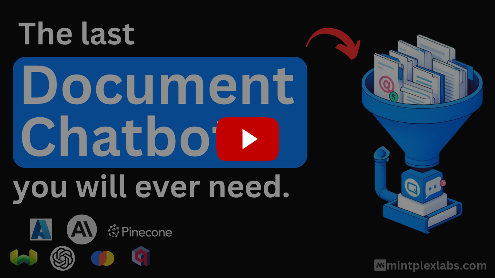

> [!NOTE]
> Ayrıca AI ajanlarının kullanabileceği eksiksiz bir bilgisayar ortamı sunan [Open Computer](../open-computer) üzerinde de çalışıyoruz.
>
> Bu, AnythingLLM'in ajan yeteneklerini yeni bir seviyeye taşıyacak ve AI ajan kullanımı için yepyeni bir UX paradigması getirecek.
>
> ⭐ Güncellemelerden haberdar olmak için depoya yıldız verin!

  

    <b>AnythingLLM:</b> Aradığınız hepsi bir arada yapay zeka uygulaması. 
    Belgelerinizle sohbet edin, yapay zeka ajanlarını kullanın; son derece özelleştirilebilir, çok kullanıcılı ve zahmetsiz kurulum.

   |
   |
  <a href="https://docs.anythingllm.com" target="_blank">
    Dokümanlar
  </a> |
  <a href="https://my.mintplexlabs.com/aio-checkout?product=anythingllm" target="_blank">
    Barındırılan Örnek
  </a>

  <a href='../README.md'>English</a> · <a href='./README.zh-CN.md'>简体中文</a> · <a href='./README.ja-JP.md'>日本語</a> · <b>Türkçe</b> · <a href='./README.fa-IR.md'>فارسی</a>

👉 Masaüstü için AnythingLLM (Mac, Windows ve Linux)! <a href="https://anythingllm.com/download" target="_blank">Şimdi İndir</a>

Belgelerinizle sohbet edin. Karmaşık iş akışlarını yapay zeka ajanlarıyla otomatikleştirin. Son derece özelleştirilebilir, çok kullanıcıya hazır, sahada denenmiş — ve varsayılan olarak sıfır kurulum zahmetiyle yerelde çalışır.

<kbd>Demoyu izle!</kbd>

### Ürün Genel Bakışı

AnythingLLM, hiçbir ödün vermeden özel ve tam donanımlı bir ChatGPT oluşturmanızı sağlayan hepsi bir arada yapay zeka uygulamasıdır. Favori yerel veya bulut LLM'inizi bağlayın, belgelerinizi yükleyin ve dakikalar içinde sohbete başlayın. Kutudan çıktığı haliyle yerleşik ajanlar, çok kullanıcılı destek, vektör veritabanları ve belge işleme hatları sunar — ek yapılandırma gerekmez.

AnythingLLM ayrıca birden fazla kullanıcıyı destekler; örneğin güvenliği, gizliliği veya fikri mülkiyetinizi tehlikeye atmadan kullanıcı başına erişimi ve deneyimi kontrol edebilirsiniz.

## AnythingLLM'in Harika Özellikleri

- [Dinamik Model Yönlendirme](https://docs.anythingllm.com/model-router/overview) - Tanımladığınız kurallara göre sohbetleri otomatik olarak en uygun sağlayıcıya ve modele yönlendirin.
- [Otomatik ve Kullanıcı Yönetimli Hafıza](https://docs.anythingllm.com/features/memories) - LLM'inizin sizinle veya çalışma alanınızla ilgili önemli bilgileri hatırlamasını sağlayın.
- [Zamanlanmış Görevler](https://docs.anythingllm.com/scheduled-jobs/overview) - Tekrarlayan görevleri veya istemleri, tüm ajan yetenekleriyle birlikte cron zamanlamasıyla çalıştırın.
- [Akıllı Beceri Seçimi](https://docs.anythingllm.com/agent/intelligent-tool-selection) Modelleriniz için **sınırsız** araç etkinleştirirken sorgu başına token kullanımını %80'e kadar azaltın
- [Kod yazmadan AI Ajanı oluşturucu](https://docs.anythingllm.com/agent-flows/overview)
- [MCP uyumluluğu](https://docs.anythingllm.com/mcp-compatibility/overview)
- [Çoklu-mod desteği (hem kapalı hem açık kaynak LLM'ler!)](https://docs.anythingllm.com/features/language-models)
- [Özel Yapay Zeka Ajanları](https://docs.anythingllm.com/agent/custom/introduction)
- 👤 Çok kullanıcılı örnek desteği ve yetkilendirme _Yalnızca Docker sürümü_
- 🦾 Çalışma alanınız içinde ajanlar (web'de gezinme vb.)
- 💬 [Web siteniz için özel gömülebilir sohbet aracı](https://github.com/Mintplex-Labs/anythingllm-embed/blob/main/README.md) _Yalnızca Docker sürümü_
- 📖 Çoklu belge türü desteği (PDF, TXT, DOCX vb.)
- Sürükle-bırak yükleme ve kaynak gösterimi olan sezgisel sohbet arayüzü.
- Her türlü bulut dağıtımı için üretime hazır.
- Tüm popüler [kapalı ve açık kaynak LLM sağlayıcılarıyla](#desteklenen-llmler-embedding-modelleri-konuşma-modelleri-ve-vektör-veritabanları) uyumlu.
- Büyük belge kümeleri için yerleşik optimizasyonlar — diğer sohbet arayüzlerine göre daha düşük maliyet ve daha hızlı yanıt.
- Özel entegrasyonlar için tam kapsamlı Geliştirici API'si!
- ...ve çok daha fazlası — dakikalar içinde kurun ve kendiniz görün.

### Desteklenen LLM'ler, Embedding Modelleri, Konuşma Modelleri ve Vektör Veritabanları

**Büyük Dil Modelleri (LLMs):**

- [Any open-source llama.cpp compatible model](/server/storage/models/README.md#text-generation-llm-selection)
- [OpenAI](https://openai.com)
- [OpenAI (Generic)](https://openai.com)
- [Azure OpenAI](https://azure.microsoft.com/en-us/products/ai-services/openai-service)
- [AWS Bedrock](https://aws.amazon.com/bedrock/)
- [Anthropic](https://www.anthropic.com/)
- [NVIDIA NIM (chat models)](https://build.nvidia.com/explore/discover)
- [Google Gemini Pro](https://ai.google.dev/)
- [Ollama (chat models)](https://ollama.ai/)
- [LM Studio (all models)](https://lmstudio.ai)
- [LocalAI (all models)](https://localai.io/)
- [Together AI (chat models)](https://www.together.ai/)
- [Fireworks AI (chat models)](https://fireworks.ai/)
- [Perplexity (chat models)](https://www.perplexity.ai/)
- [OpenRouter (chat models)](https://openrouter.ai/)
- [DeepSeek (chat models)](https://deepseek.com/)
- [Mistral](https://mistral.ai/)
- [Groq](https://groq.com/)
- [Cohere](https://cohere.com/)
- [KoboldCPP](https://github.com/LostRuins/koboldcpp)
- [LiteLLM](https://github.com/BerriAI/litellm)
- [Text Generation Web UI](https://github.com/oobabooga/text-generation-webui)
- [Apipie](https://apipie.ai/)
- [xAI](https://x.ai/)
- [Z.AI (chat models)](https://z.ai/model-api)
- [Novita AI (chat models)](https://novita.ai/model-api/product/llm-api?utm_source=github_anything-llm&utm_medium=github_readme&utm_campaign=link)
- [PPIO](https://ppinfra.com?utm_source=github_anything-llm)
- [Gitee AI](https://ai.gitee.com/)
- [Moonshot AI](https://www.moonshot.ai/)
- [Microsoft Foundry Local](https://github.com/microsoft/Foundry-Local)
- [CometAPI (chat models)](https://www.cometapi.com/)
- [llmman](https://github.com/llmmanorg/llmman)
- [PrivateModeAI (chat models)](https://privatemode.ai/)
- [SambaNova Cloud (chat models)](https://cloud.sambanova.ai/)
- [Lemonade by AMD](https://lemonade-server.ai)
- [Minimax](https://platform.minimax.io)
- [Cerebras (chat models)](https://www.cerebras.ai/)
- [oMLX](https://github.com/jundot/omlx)

**Embedder modelleri:**

- [AnythingLLM Native Embedder](/server/storage/models/README.md) (default)
- [OpenAI](https://openai.com)
- [Azure OpenAI](https://azure.microsoft.com/en-us/products/ai-services/openai-service)
- [Gemini](https://ai.google.dev/)
- [LocalAI (all)](https://localai.io/)
- [Ollama (all)](https://ollama.ai/)
- [LM Studio (all)](https://lmstudio.ai)
- [Lemonade](https://lemonade-server.ai)
- [OpenRouter](https://openrouter.ai/)
- [LiteLLM](https://github.com/BerriAI/litellm)
- [Cohere](https://cohere.com/)
- [Voyage AI](https://www.voyageai.com/)
- [Mistral](https://mistral.ai/)
- Generic OpenAI-compatible embedding APIs

**Ses Transkripsiyon Modelleri:**

- [AnythingLLM Built-in](https://github.com/Mintplex-Labs/anything-llm/tree/master/server/storage/models#audiovideo-transcription) (default)
- [OpenAI](https://openai.com/)

**TTS (metinden konuşmaya) desteği:**

- Native Browser Built-in (default)
- [PiperTTSLocal - runs in browser](https://github.com/rhasspy/piper)
- [OpenAI TTS](https://platform.openai.com/docs/guides/text-to-speech#voice-options)
- [ElevenLabs](https://elevenlabs.io/)
- Any OpenAI Compatible TTS service.

**STT (konuşmadan metne) desteği:**

- Tarayıcı Yerleşik (varsayılan)

**Vektör Veritabanları:**

- [LanceDB](https://github.com/lancedb/lancedb) (default)
- [PGVector](https://github.com/pgvector/pgvector)
- [Astra DB](https://www.datastax.com/products/datastax-astra)
- [Pinecone](https://pinecone.io)
- [Chroma & ChromaCloud](https://trychroma.com)
- [Weaviate](https://weaviate.io)
- [Qdrant](https://qdrant.tech)
- [Milvus](https://milvus.io)
- [Zilliz](https://zilliz.com)

### Teknik Genel Bakış

Bu monorepo altı ana bölümden oluşmaktadır:

- `frontend`: LLM'in kullanabileceği tüm içeriği kolayca oluşturup yönetmenizi sağlayan viteJS + React tabanlı bir ön yüz.
- `server`: Tüm etkileşimleri yöneten, vektör veritabanı yönetimi ve LLM entegrasyonlarını gerçekleştiren NodeJS express sunucusu.
- `collector`: Kullanıcı arayüzünden gelen belgeleri işleyen ve ayrıştıran NodeJS express sunucusu.
- `docker`: Docker talimatları, derleme süreci ve kaynak koddan derleme bilgileri.
- `embed`: [Web gömme aracının](https://github.com/Mintplex-Labs/anythingllm-embed) üretimi ve oluşturulması için alt modül.
- `browser-extension`: [Chrome tarayıcı eklentisi](https://github.com/Mintplex-Labs/anythingllm-extension) için alt modül.

## 🛳 Kendi Sunucunuzda Barındırma

Mintplex Labs ve topluluk, AnythingLLM'i yerel olarak çalıştırmak için çeşitli dağıtım yöntemleri, betikler ve şablonlar sunmaktadır. Tercih ettiğiniz ortamda nasıl dağıtım yapacağınızı öğrenmek veya otomatik dağıtım için aşağıdaki tabloya bakın.
| Docker | AWS | GCP | Digital Ocean | Render.com |
|----------------------------------------|----|-----|---------------|------------|
| [![Deploy on Docker][docker-btn]][docker-deploy] | [![Deploy on AWS][aws-btn]][aws-deploy] | [![Deploy on GCP][gcp-btn]][gcp-deploy] | [![Deploy on DigitalOcean][do-btn]][do-deploy] | [![Deploy on Render.com][render-btn]][render-deploy] |

| Railway                                             | RepoCloud                                                 | Elestio                                             | Northflank                                                   | Sealos                                               |
| --------------------------------------------------- | --------------------------------------------------------- | --------------------------------------------------- | ------------------------------------------------------------ | ---------------------------------------------------- |
| [![Deploy on Railway][railway-btn]][railway-deploy] | [![Deploy on RepoCloud][repocloud-btn]][repocloud-deploy] | [![Deploy on Elestio][elestio-btn]][elestio-deploy] | [![Deploy on Northflank][northflank-btn]][northflank-deploy] | [![Deploy on Sealos][sealos-btn]][sealos-deploy] |

[veya Docker kullanmadan üretim ortamında bir AnythingLLM örneği kurun →](../BARE_METAL.md)

## Geliştirme İçin Kurulum

- `yarn setup` Uygulamanın her bölümünde ihtiyaç duyacağınız `.env` dosyalarını oluşturur (deponun kök dizininden).
  - Devam etmeden önce bunları doldurun. `server/.env.development` dosyasının doldurulduğundan emin olun, aksi takdirde işler düzgün çalışmaz.
- `yarn dev:server` Sunucuyu yerel olarak başlatır (deponun kök dizininden).
- `yarn dev:frontend` Ön yüzü yerel olarak başlatır (deponun kök dizininden).
- `yarn dev:collector` Ardından belge toplayıcıyı çalıştırır (deponun kök dizininden).

[Belgeler hakkında bilgi edinin](../server/storage/documents/DOCUMENTS.md)

## Telemetri ve Gizlilik

Mintplex Labs Inc tarafından geliştirilen AnythingLLM, anonim kullanım bilgileri toplayan bir telemetri özelliği içerir.

<kbd>AnythingLLM için Telemetri ve Gizlilik hakkında daha fazla bilgi</kbd>

### Neden?

Bu bilgileri AnythingLLM'in nasıl kullanıldığını anlamak, yeni özellikler ve hata düzeltmelerine öncelik vermek ve AnythingLLM'in performansı ile kararlılığını iyileştirmek için kullanıyoruz.

### Devre Dışı Bırakma

Telemetriyi devre dışı bırakmak için sunucu veya docker .env ayarlarınızda `DISABLE_TELEMETRY` değerini "true" yapın. Bunu uygulama içinde de yapabilirsiniz: kenar çubuğu > `Gizlilik` > telemetriyi kapatın.

### Tam Olarak Neleri Takip Ediyorsunuz?

Yalnızca ürün ve yol haritası kararlarını almamıza yardımcı olan kullanım ayrıntılarını takip ediyoruz, özellikle:

- Kurulumunuzun türü (Docker veya Masaüstü)

- Bir belgenin eklenmesi veya kaldırılması. Belge _hakkında_ hiçbir bilgi toplanmaz. Yalnızca olayın gerçekleştiği kaydedilir. Bu bize kullanım hakkında fikir verir.

- Kullanılan vektör veritabanı türü. Bu, ilgili sağlayıcı için güncellemeler geldiğinde değişikliklere öncelik vermemize yardımcı olur.

- Kullanılan LLM sağlayıcısı ve model etiketi. Bu, ilgili sağlayıcı veya model ya da bunların birleşimi için güncellemeler geldiğinde değişikliklere öncelik vermemize yardımcı olur. Örneğin: akıl yürüten modellere karşı normal modeller, çoklu-mod modelleri vb.

- Bir sohbet gönderildiğinde. Bu en düzenli "olay" olup, projenin tüm kurulumlardaki günlük etkinliği hakkında fikir verir. Yine yalnızca **olay** gönderilir — sohbetin niteliği veya içeriği hakkında hiçbir bilgimiz olmaz.

Bu iddiaları `Telemetry.sendTelemetry` çağrılarının tüm konumlarını bularak doğrulayabilirsiniz. Ayrıca etkinleştirilmişse bu olaylar çıktı günlüğüne yazılır, böylece gönderilen verileri de görebilirsiniz. **Hiçbir IP veya tanımlayıcı bilgi toplanmaz**. Telemetri sağlayıcısı, açık kaynaklı bir telemetri toplama hizmeti olan [PostHog](https://posthog.com/)'dur.

Gizliliği çok ciddiye alıyoruz ve rahatsız edici anket pencereleri kullanmadan aracımızın nasıl kullanıldığını öğrenmek istediğimizi anlayışla karşılayacağınızı umuyoruz; böylece kullanmaya değer bir şey inşa edebiliriz. Anonim veriler üçüncü taraflarla _asla_ paylaşılmaz.

[Kaynak kodundaki tüm telemetri olaylarını görüntüle](https://github.com/search?q=repo%3AMintplex-Labs%2Fanything-llm%20.sendTelemetry(&type=code)

### Diğer Dışa Bağlantılar

Telemetriyi devre dışı bıraksanız bile aşağıdaki hizmetlere giden bağlantıları görmeye devam edersiniz:

- Harici bir araç, LLM, Embedding modeli veya Vektör veritabanı kullanıyorsanız, ilgili hizmet sağlayıcısına giden bağlantıları görmeye devam edersiniz.
- `cdn.anythingllm.com` modelleri ayna CDN'imizden çekmek için kullanılır. Bu telemetri tarafından takip edilmez ve VPN kısıtlaması olan bölgelerdekiler için oldukça faydalıdır.
- `github/githubusercontent.com` Bağlam penceresi önbelleklemesi için bu alan adlarından bazı düz dosyalar indirilir.

Temel olarak, telemetri devre dışıysa hiçbir şey toplamayız. Ancak kurulumunuza bağlı olarak dışa bağlantılar görebilir ve ilgili hizmet sağlayıcısının hizmet şartlarına tabi olabilirsiniz.

## 👋 Katkıda Bulunma

- [AnythingLLM'e Katkıda Bulunma](../CONTRIBUTING.md) - AnythingLLM'e nasıl katkıda bulunulur.

## 🌟 Katkıda Bulunanlar

## 🔗 Diğer Ürünler

- **[AnythingLLM Mobile (MIT Lisanslı)][anythingllm-mobile]:** AnythingLLM'i mobil cihazınızda kullanmanızı sağlayan mobil uygulama.
- **[AnythingLLM Tarayıcı Eklentisi][anythingllm-extension]:** AnythingLLM'i tarayıcınızda kullanmanızı sağlayan tarayıcı eklentisi.
- **[AnythingLLM Embed][anythingllm-embed]:** AnythingLLM'i web sitenize gömmenizi sağlayan bir araç.

[![][back-to-top]](#readme-top)

---

Telif Hakkı © 2026 [Mintplex Labs][profile-link].  
Bu proje [MIT](../LICENSE) lisansı ile lisanslanmıştır.

<!-- LINK GROUP -->

[back-to-top]: https://img.shields.io/badge/-BACK_TO_TOP-222628?style=flat-square
[profile-link]: https://github.com/mintplex-labs
[anythingllm-mobile]: https://github.com/Mintplex-Labs/anythingllm-mobile
[anythingllm-extension]: https://github.com/Mintplex-Labs/anythingllm-extension
[anythingllm-embed]: https://github.com/Mintplex-Labs/anythingllm-embed
[docker-btn]: ../images/deployBtns/docker.png
[docker-deploy]: ../docker/HOW_TO_USE_DOCKER.md
[aws-btn]: ../images/deployBtns/aws.png
[aws-deploy]: ../cloud-deployments/aws/cloudformation/DEPLOY.md
[gcp-btn]: https://deploy.cloud.run/button.svg
[gcp-deploy]: ../cloud-deployments/gcp/deployment/DEPLOY.md
[do-btn]: https://www.deploytodo.com/do-btn-blue.svg
[do-deploy]: ../cloud-deployments/digitalocean/terraform/DEPLOY.md
[render-btn]: https://render.com/images/deploy-to-render-button.svg
[render-deploy]: https://render.com/deploy?repo=https://github.com/Mintplex-Labs/anything-llm&branch=render
[render-btn]: https://render.com/images/deploy-to-render-button.svg
[render-deploy]: https://render.com/deploy?repo=https://github.com/Mintplex-Labs/anything-llm&branch=render
[railway-btn]: https://railway.app/button.svg
[railway-deploy]: https://railway.app/template/HNSCS1?referralCode=WFgJkn
[repocloud-btn]: https://d16t0pc4846x52.cloudfront.net/deploylobe.svg
[repocloud-deploy]: https://repocloud.io/details/?app_id=276
[elestio-btn]: https://elest.io/images/logos/deploy-to-elestio-btn.png
[elestio-deploy]: https://elest.io/open-source/anythingllm
[northflank-btn]: https://assets.northflank.com/deploy_to_northflank_smm_36700fb050.svg
[northflank-deploy]: https://northflank.com/stacks/deploy-anythingllm
[sealos-btn]: https://sealos.io/Deploy-on-Sealos.svg
[sealos-deploy]: https://sealos.io/products/app-store/anything-llm
